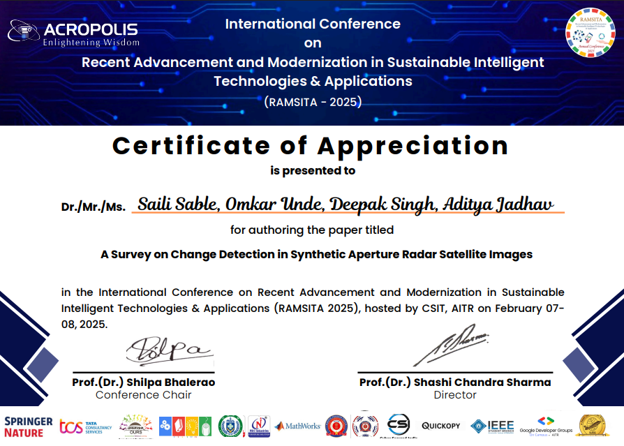
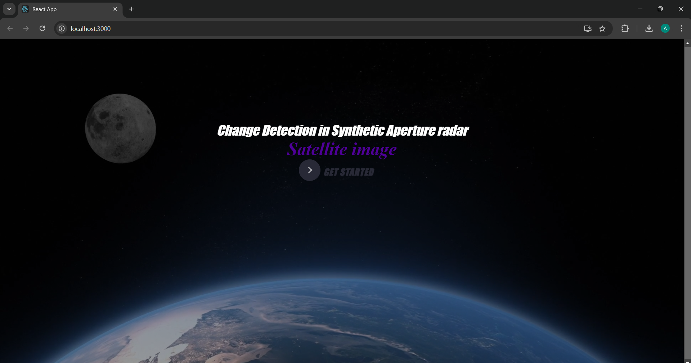
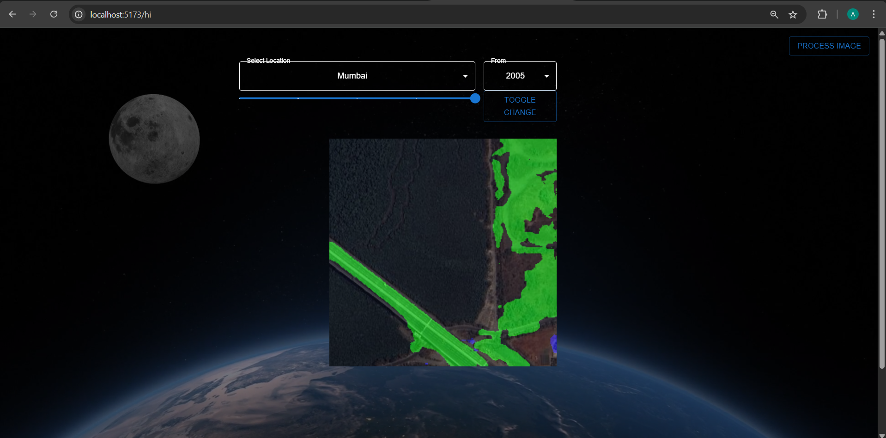
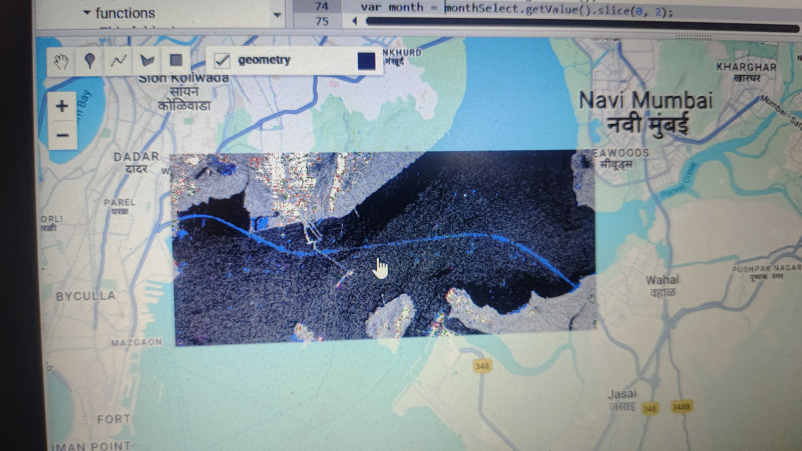

# 🛰️ SAR-Based Change Detection System

> 🏆 **Recognitions**  
> 🥇 **1st Prize** – Project Building and Idea Pitching Competition by **Anudip Foundation**
>### 🎖️ Certificate 1 – Anudip Foundation (1st Prize)

> 📄 **Research Paper Accepted** – *RAMSITA-2025* International Conference on Sustainable Intelligent Technologies & Applications
> ### 📄 Certificate 2 – RAMSITA 2025 (Paper Accepted)

> 📸 Output screenshots and certificates included below

---

## 📌 Project Overview

Change detection in satellite imagery is essential for tracking environmental transformation, urban development, and disaster impact. This project uses **Synthetic Aperture Radar (SAR)** data and **machine learning algorithms** to detect man-made changes while overcoming challenges like speckle noise and misclassification.

SAR images are unique in their ability to capture Earth's surface regardless of weather and light, but interpreting them requires advanced processing. Our system leverages **deep learning techniques** (e.g., CNNs) and **image processing pipelines** to enhance accuracy and scalability.

---

## 🎯 Objective

- Build a reliable, scalable SAR change detection system.
- Detect **man-made changes** while filtering out natural ones.
- Minimize false positives caused by environmental or seasonal variations.

---

## 🧠 Methodology

### 📥 Data Acquisition
- Source: Sentinel-1 SAR images
- Tools: Google Earth Engine, SNAP Toolbox

### 🧹 Preprocessing
- Noise reduction filters
- Radiometric calibration
- Geometric correction

### 🧠 Change Detection Techniques
- Image differencing
- Support Vector Machines (SVM)
- Convolutional Neural Networks (CNN)
- Focused filtering to ignore natural changes

### 🗺️ Output Generation
- Export in formats like Shapefile and GeoJSON
- Visual change maps using QGIS and GeoPandas

---

## 🧪 Experimental Setup

| Component | Details |
|----------|---------|
| **Data Source** | Sentinel-1 GRD datasets |
| **Preprocessing** | SNAP, GDAL, NumPy |
| **Algorithms** | TensorFlow, PyTorch, OpenCV |
| **Visualization** | QGIS, GeoPandas |
| **Client Requirements** | 8GB RAM, browser interface |
| **Server Requirements** | Linux/Windows, Python, ReactJS |

---

## 📊 Results

- High-resolution change detection maps generated.
- Successfully identified man-made transformations such as **urban growth**, **deforestation**, and **post-disaster damage**.
- Achieved higher accuracy using **deep learning** over traditional methods.

---

## 🧩 Challenges Addressed

- Improved robustness to speckle noise.
- Scalable for different geographies and imaging conditions.

---

## 🔮 Future Scope

- Integrate real-time analysis with edge computing.
- Improve generalization to different terrains and seasons.
- Implement cloud-based processing for large-scale data.
- Incorporate **hybrid deep learning models** (CNN + RNN).

---

## 📷 Output Samples

### 📸 Output Screenshot 1 

### 🧭 Output Screenshot 2 

### 🌆 Output Screenshot 3 

---

## 👨‍💻 Authors

- Omkar Unde  
- Deepak Singh  
- Aditya Jadhav  
- Saili Sable  
🎓 *Nutan College of Engineering and Research*

---

